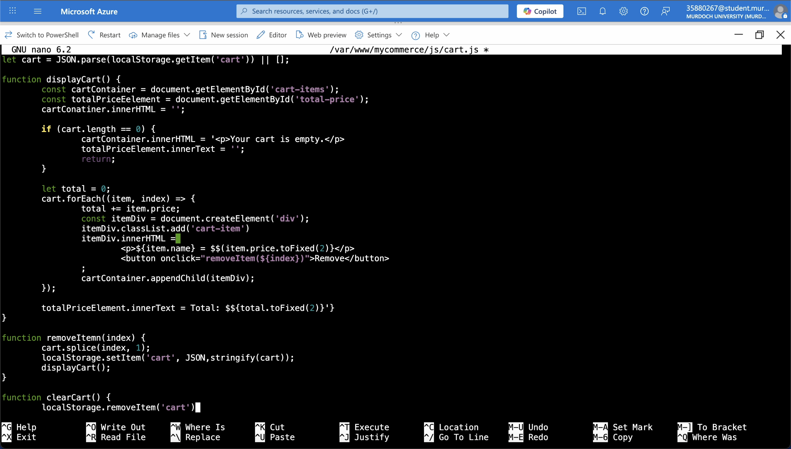

Cart Page
This is the final HTML page to be created for the website, and on this page lies a shopping cart mock-up,
where customers' items go when they click on add item, in the product pages HTML. Below is the HTML code for the cart:

```<!DOCTYPE html>
<html lang="en">
<head>
        <meta charset="UTF-8">
        <meta name="viewport" content="width=device-width, initial-scale=1.0">
        <title>Your Cart - SwiftShop</title>
        <link rel="stylesheet" href="css/style.css">
</head>
<body>
        <header>
                <h1>Your Shopping Cart</h1>
                <nav>
                        <a href="index.html">Home</a>
                        <a href="men.html">Men</a>
                        <a href="women.html">Women</a>
                        <a href="accessories.html">Accessories</a>
                </nav>
        </header>

        <section class="cart-container">
                <h2>Items in Your Cart<h2>
                <div id="cart-items"></div>
                <h3 id="total-price"></h3>
                <button onclick="clearCart()">Clear Cart</button>
        </section>

        <footer>
                <p>&copy; 2025 SwiftShop, All Rights Reserved.</p>
        </footer>

        <script src="js/cart.js"></script>

        <section class="checkout-form-container">
                <h2>Checkout</h2>
                <form id="checkout-form">
                <input type="text" name="name" placeholder="Full Name" required>
                        <input type="email" name="email" placeholder="Email Address" required>
                        <input type="text" name="address" placeholder="Shipping Address" required>
                        <button type="submit">Place Order</button>
                </form>
        </section>
</body>
</html>
```


Alongside the cart HTML page, a Java page was also created to simulate the storing of the name and price of
items in the cart HTML: 



