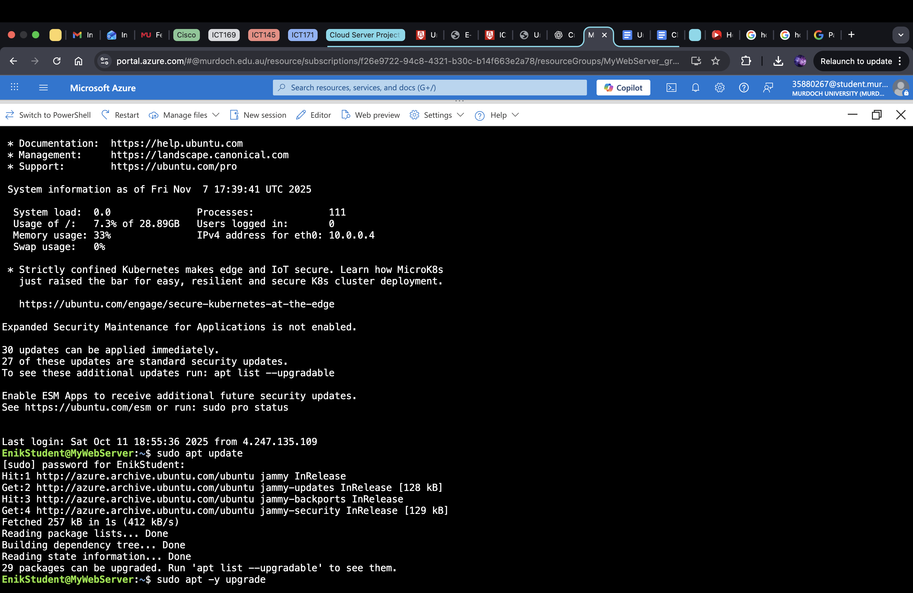
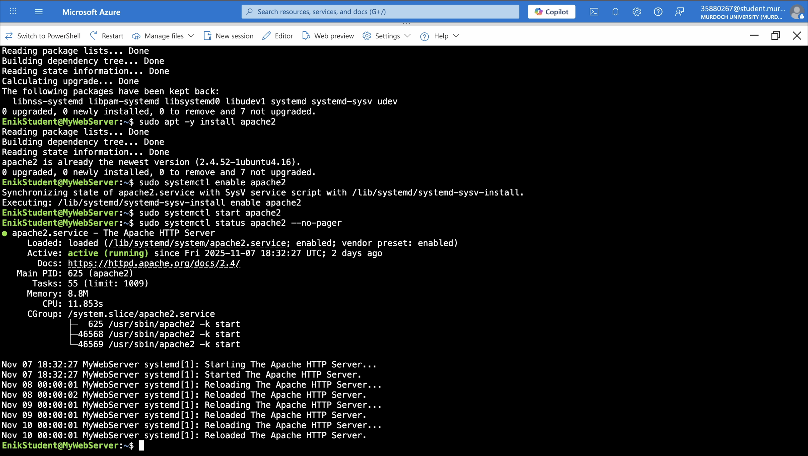
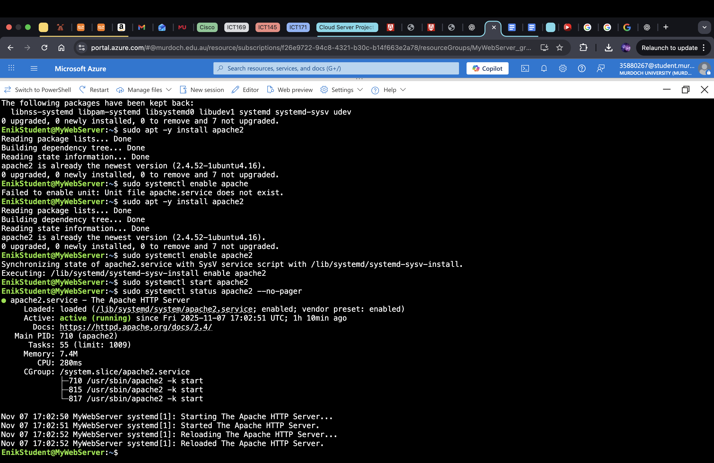
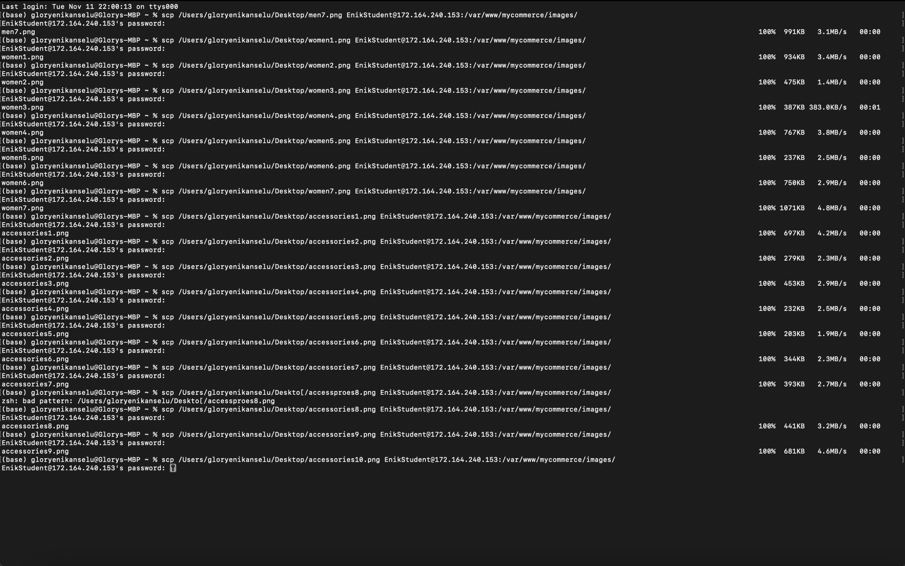
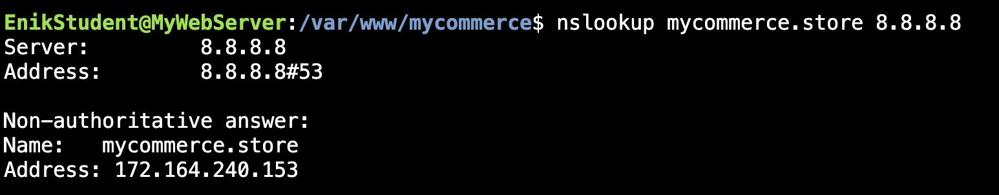
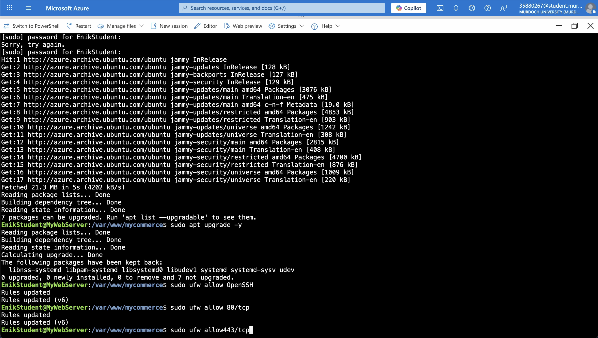
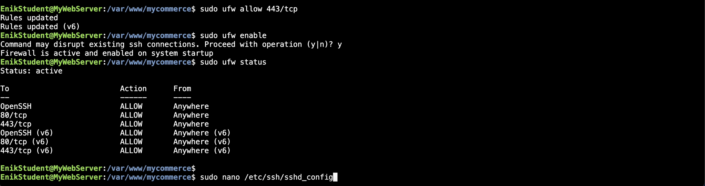
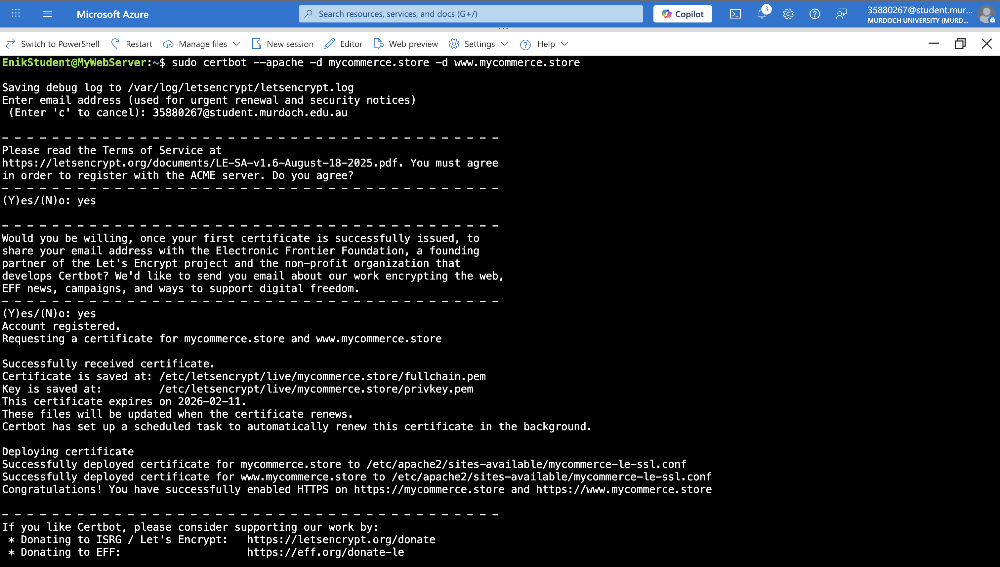
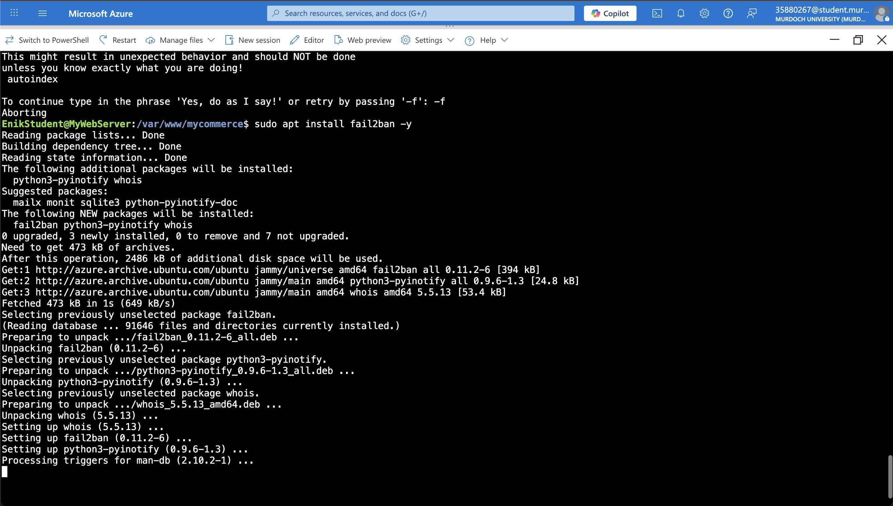
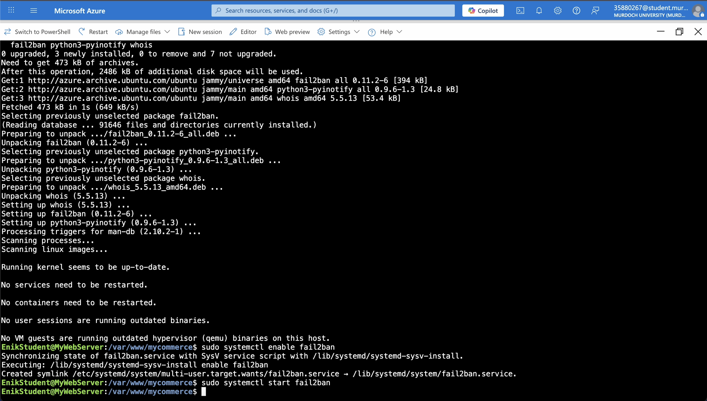

Student Name: Precious Glory Enikanselu

Student ID: 35880267

ICT171 Cloud Server Project
cloud-based server deployment demonstrating IaaS configuration, DNS setup, SSL/TLS implementation, and automation scripting.

This project was created as part of Murdoch University’s ICT171: Introduction to Server Environments and Architectures to demonstrate cloud server configuration and documentation skills.

Server Overview:
Platform: Microsoft Azure 
Server Type: Linux (Ubuntu)
Purpose: Webstore

Setup Instructions:
Deploy a virtual machine using IaaS
Configure networking and firewall rules
Install web server software (Apache)
Link DNS domain
Enable SSL/TLS
Test and document the process

Repository Contents
/docs — Markdown documentation
/scripts — Configuration or automation scripts
/video — Link to video explainer
/LICENSE — License information

Created for Murdoch's ICT171

In order to create the website on Microsoft Azure's VM, Apache2 needs to be installed and
updated on the VM, this is done in the following screenshots:







After the installation and updating of Aoache2, the webpages of the website are created using the command 'sudo nano name.html'.
Three webpages are made for the products section of my website, and they are all named based on their section.
Below are brief samples of the code used to build the webpages of my website:

- HomePage-
[HomePage.md](CreationofWebpages-HomePage.md)

- Men Section Page-
[MenSectionPage.md](CreationofWebpages-MenSection.md)

- Female Section Page-
[FemaleSectionPage.md](CreationofWebpages-WomenSection.md)

- Accessories Section Page-
[AccessoriesSectionPage.md](CreationofWebpages-AccessoriesSection.md)

While making these webpages, seemingly minor but obviously important syntax errors were present
so these errors were identified and fixed for the webpages to be deployed successfully.


After creation of the webpages for the website, additional pages such as the contact and about page
are made. Find them below:

- About Page-
```!DOCTYPE html>
<html lang="en">
<head>
        <meta charset="UTF-8">
        <meta name="viewport" content="width=device-width, initial-scale=1.0">
        <title>About - SwiftShop</title>
        <link rel="stylesheet" href="css/style.css">
</head>
<body>
        <header>
                <h1>SwiftShop</h1>
                <p>Your Style, Delivered</p>
        </header>

        <nav>
                <a href="index.html">Home</a>
                <a href="men.html">Men</a>
                <a href="women.html">Women</a>
                <a href="accessories.html">Accessories</a>
                <a href="about.html">About</a>
                <a href="contact.html">Contact</a>
        </nav>

        <section class="about">
                <h2>About SwiftShop</h2>
                <p>SwiftShop was founded to bring style, quality, and convenience together in one place. Our mission is to make fashion accessible,
                   comfortable, and stylish for everyone.</p>
                <p>We carefully create each collection and focus on quality materials, sustainable practices, and excellent customer service.</p>
        </section>
</body>
</html>
```

- Contact Page-
```<!DOCTYPE html>
<html lang="en">
<head>
        <meta charset="UTF-8">
        <meta name="viewport" content="width=device-width, initial-scale=1.0">
        <title>Contact - SwiftShop</title>
        <link rel="stylesheet" href="css/style.css">
</head>
<body>
        <header>
                <h1>SwiftShop</h1>
                <p>Your Style, Delivered</p>
        </header>

        <nav>>
        <a href="index.html">Home</a>
        <a href="men.html">Men</a>
        <a href="women.html">Women</a>
        <a href="accessories.html">Accessories</a>
        <a href="about.html">About</a>
        <a href="contact.html">Contact</a>
        </nav>

        <section class="contact">
                <h2>Contact Us</h2>
                <p>Email:support@mycommerce.store</p>
                <p>Phone: +1 555 123 4567</p>
                <p>Address: 123 Fashion Street, Style City</p>

                <h3>Send us a message</h3>
                <form>
                        <input type="text" name="name" placeholder="Your Name" required><br><br>
                        <input type="email" name="email" placeholder= "Your Email" required><br><br>
                        <textarea name="message" placeholder="Your Message" rows="5" required></textarea><br><br>
                        <button type="submit">Send Message</button>
                </form>
        </section>
</body>
</html>
```

Images-
Next, to upload images for products on my website, I have taken screenshots of random products online, and
in the terminal of my laptop, I have used the path of each image to save the images onto my Microsoft Azure virtual machine, using
the virtual machine name and public IP Address. Below is a screenshot of my terminal:




Finally, the last webpage to be created is the cart webpage - [Cartpage.md](Cartpage.md)


DNS Linking

After the creation of the website, the next thing to do is to link it to a domain name, so it is usable on a web browser by anyone.
To do this, first, a domain name must be bought from a provider such as GoDaddy or Squarespace. I have bought my domain name, mycommerce.store, from
Squarespace, and have linked it on the Squarespace website to the public IP of my Microsoft Azure virtual machine: 


The following configuration is also put in place on the virtual machine so that it can also be linked to the domain name from Squarespace:
```
<VirtualHost *:80>
        ServerName mycommerce.store
        ServerAlias www.mycommerce.store
        DocumentRoot /var/www/html
        <Directory /var/www/html>
                AllowOverride All
        </Directory>
        Erroring ${APACHE_LOG_DIR}/error.log
        CustomLog ${APACHE_LOG_DIR}/access.log combines
</VirtualHost>
```

To confirm the link of my virtual machine files, and the domain name from Squarespace, I run the command nslookup mycommerce.store 8.8.8.8
so that the current record of the IP address from mycommerce.store is shown, and with the IP address of my Azure virtual machine showing, this means
the Domain name has been successfully linked.




Finally, to complete the creation of the website, the last thing to do is configure the firewall and brute force protection on the website
The following screenshots shows the list of correct commands use to secure the website:















Some syntax errors were present in the initial version of the code. These errors have been identified and corrected progressively throughout 
the program to ensure proper functionality. The corrected code now runs as intended, with all previous syntax issues resolved.


In conclusion, this repository provides a complete overview of the project, including explanations, examples, and corrected code. 
All sections have been carefully documented using actual code and screenshots of the code  to ensure clarity and usability, 
allowing users to understand, run, and modify the code effectively. This repository is now structured and may be used as a reference 
and guide for future development.


Attached is the documentation of the creation of this website via screenshots:
[View the Project Report](CloudServerProject.pdf)

Attached is the link to the web server:
https://mycommerce.store or www.mycommerce.store

Below is the video explainer for the creation of this website:
[Watch the Video Explainer here](https://github.com/gen365/Cloud-Server-Project-Documentation/releases/download/v1.0/VideoExplainer.mov)
